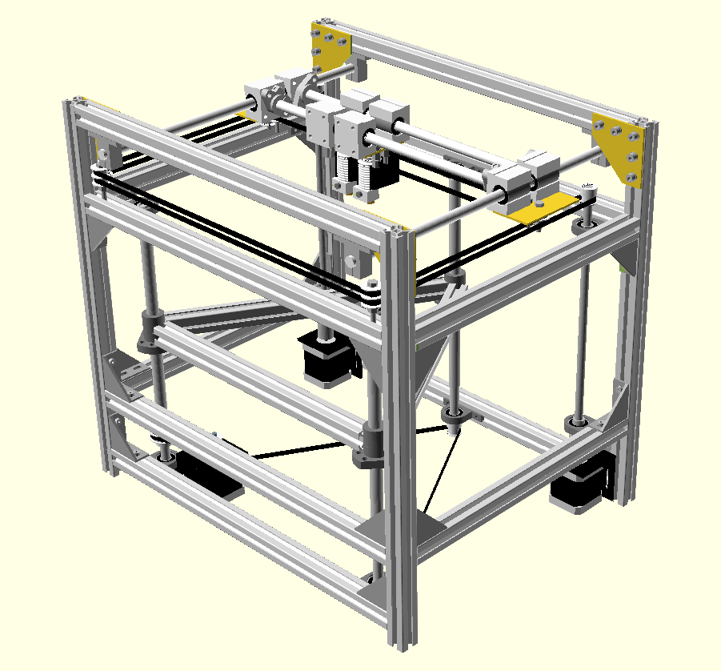

# R2-3D

My home brewed coreXY 3d printer
The name "R2-3D" is a tribute to R2-D2 and his creator George Lucas who made me just love things that moves by software, 
electronics and pure mechanics.

History:
A few years ago I put together a #d printer kit from Welleman. 
It was their K8200 and I call it "put together" because it was like building Lego or Mecchano for us born back in the 70s.
I had a lot of fun with it and the complete build took about 24 hours from opening the box to the first print out.

But after some use I was not so impressed by the prints and a whole summer vacation full of modifications
did not satisfy me. There where too many issues with the design and I soon reached the end of the road.
The mechanics was not an big issue... it was the basic design.

After reading a lot of forum threads,and I meen a lot...! I started to notice a pattern with the same problems occuring in
most of the common and open designs of 3d-printers.

The roundup is as follows:

Z-Axis 
Printbed not as flat as needed for a solid gripping first layer
X and Y differs from the Z plane at diffrent locations due to slack or gravity bend on the axis
Heatbed does not deliver the high temperatures needed for printing ABS and other tough filaments
An asymetric drive of the axis contributes to both a diffrence in the Z-plane and a non perfect angle on the moves
ABS warps due to the fact that it shrinks when getting cold. 

This is all about mechanics. 
You can try to fix some in software like autoprobing, primeing the first layer, slack compensate 
and so on, but all is still just quick fixes and if you just change filament you have to start all over and 
re-tweek your firmware

CoreXY:
There are some flavours of this type of coordinate system. But as I see it is only one basic design that is the "real" stuff
ref: http://corexy.com/theory.html

The CoreXY has benifits from other more common coordinate systems. It pulls and holds the movement on the X- and Y-axis in 
four points all the time. It sits on the top of the printer and that makes it possible to have a fixed Z-plane in the X- and 
Y-axis and only a linear move in the verical axis. This is a better aproach from the desings where the printbed moves in more 
than one plane. It gives us higher control of the critical Z-plane and fewer factors that will interfer with the need for high 
precision.  
The design with X- and Y- in the top just invites for a heatchamber. But then we shuold try to minimize the amount of motors and 
electronics in the heated volym. 

This Git is my part on delivering back stuff to the comunity of open source and open designs 
But it is still "in the making" My prototype printer works and it's time to release it

My first dry run https://youtu.be/AdaIRemX2_0

// Agge
